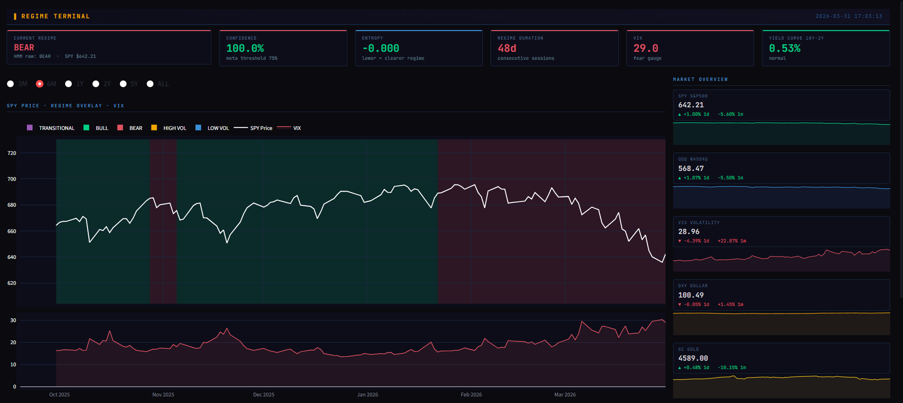
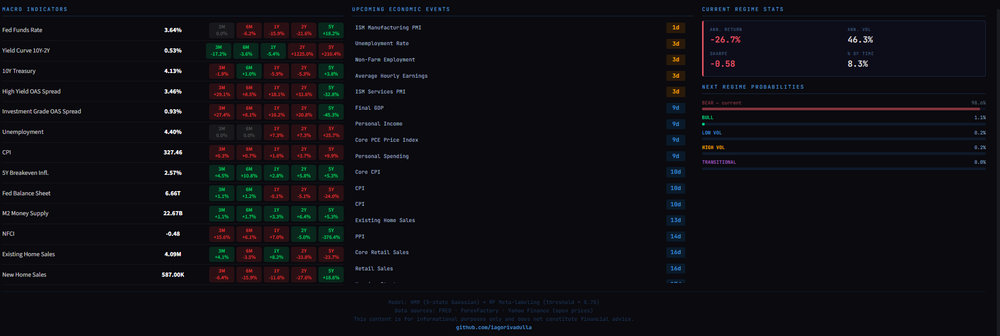

# 🚀 Market-Regime-ML-Meta-Labeling-System


## 🖥️ Dashboard interactivo

Este proyecto incluye un dashboard interactivo creado en `src/dashboard.py` que se ejecuta con Streamlit.

```bash
streamlit run src/dashboard.py
```





## 📌 Descripción

Este repositorio es un sistema de detección de regímenes de mercado que combina:

- datos de precios financieros,
- indicadores macroeconómicos,
- eventos económicos históricos,
- modelos de Markov ocultos (HMM),
- y un enfoque de meta-etiquetado para mejorar señales de trading.

El objetivo es convertir datos financieros complejos en una estructura procesable para análisis de regímenes y estrategias basadas en machine learning.

## ✨ Principales funcionalidades

- **Extracción de datos**: descarga histórica de precios, datos macroeconómicos y eventos.
- **Procesamiento de señales**: aplica indicadores técnicos con TA-Lib y organiza datos macroeconómicos.
- **Modelado de regímenes**: identifica estados de mercado con HMM multivariantes.
- **Meta-etiquetado**: crea una capa de validación de señales para mejorar la calidad de las decisiones.
- **Persistencia en SQLite**: guarda datos en una base local para análisis y reproducibilidad.

## 📦 Dependencias principales

Las dependencias se encuentran en `requirements.txt`. Entre las más relevantes están:

- `SQLAlchemy`
- `pandas`
- `numpy`
- `TA-Lib`
- `hmmlearn`
- `selenium`
- `undetected-chromedriver`
- `yfinance`
- `fredapi`
- `xgboost`
- `plotly`
- `streamlit`

## 🚀 Instalación rápida

1. Clona el repositorio:

```bash
git clone https://github.com/iagorivadulla/Market-Regime-ML-Meta-Labeling-System.git
cd Market-Regime-ML-Meta-Labeling-System
```

2. Instala las dependencias:

```bash
pip install -r requirements.txt
```

3. Configura tu API key de FRED creando un archivo `.env` en la raíz del proyecto:

```text
API_KEY=tu_api_key_aqui
```

## 🛠️ Uso básico

Para extraer y preparar los datos, ejecuta:

```bash
python src/get_all_data.py
```

Esto generará la base de datos SQLite en `data/raw/data.db` con tablas que incluyen precios, macro, eventos y programación de eventos.

## 🖥️ Dashboard interactivo

Una vez que tengas los datos y los modelos guardados en la carpeta `models/`, puedes abrir el panel desde `src` con Streamlit:

```bash
streamlit run src/dashboard.py
```

El dashboard está diseñado como una terminal estilo Bloomberg para visualizar regímenes de mercado, indicadores macroeconómicos y señales de meta-etiquetado.


## 📁 Estructura del proyecto

- `data/raw/`: scripts para descarga y creación de datos originales.
- `data/interim/`: procesamiento intermedio y limpieza.
- `data/processed/`: generación del dataset final combinado.
- `models/`: notebooks y archivos de modelos entrenados para HMM y meta-etiquetado.
- `src/get_all_data.py`: script principal de carga y preparación de datos.
- `src/dashboard.py`: dashboard Streamlit para visualización y análisis.

## 🧪 Notebooks de referencia

Explora los notebooks para entender la lógica del modelo y del meta-etiquetado:

- `models/hmm_model.ipynb`
- `models/hmm_model_testing_components.ipynb`
- `models/metalabeling.ipynb`
- `models/metalabeling_testing.ipynb`
- `models/position_sizing.ipynb`

## 💡 Ejemplo de uso en Python

```python
import sqlalchemy as db
from data.processed.final_db import final_db

engine = db.create_engine('sqlite:///data/raw/data.db')
df = final_db(engine)
print(df.head())
```

## 🤝 Contribuciones

Si quieres colaborar:

1. Haz un fork del repositorio.
2. Crea una rama con tu feature.
3. Envía un pull request.

## 📄 Licencia

Proyecto bajo licencia MIT. Consulta el archivo `LICENSE`.

## 📞 Contacto

Para dudas o comentarios, visita:

[https://github.com/iagorivadulla](https://github.com/iagorivadulla)
