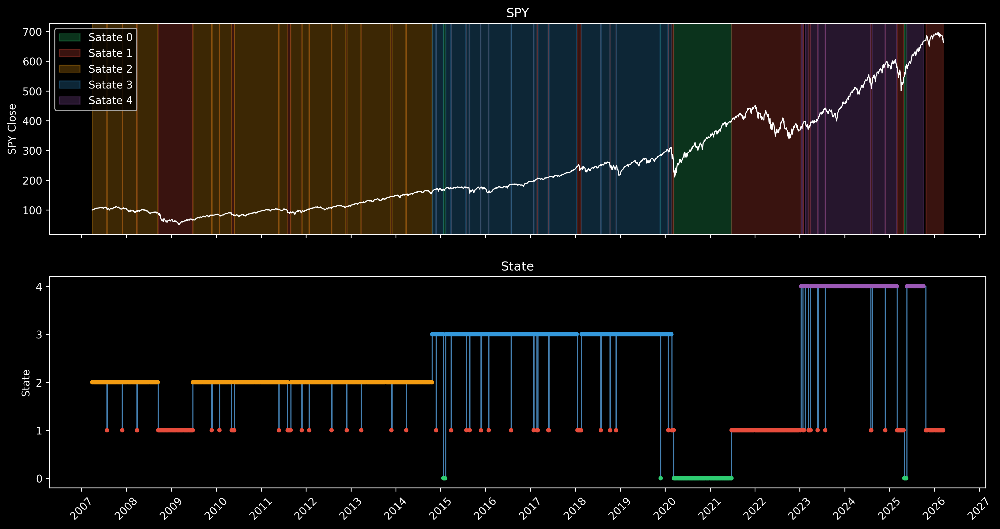

# 🚀 Market-Regime-ML-Meta-Labeling-System


## 📈 Visualización de Regímenes de Mercado



## 📋 Descripción

Este proyecto es un sistema de **machine learning** avanzado para la detección de regímenes de mercado utilizando **meta-etiquetado** (meta-labeling). El sistema recopila datos financieros históricos, indicadores macroeconómicos y eventos económicos para identificar diferentes estados de mercado (regímenes) mediante modelos de **Markov ocultos (HMM)** y aplicar técnicas de meta-etiquetado para mejorar las decisiones de trading. 🤖📈

## ✨ Características

- **🔄 Recopilación de datos automatizada**: Descarga precios de acciones, indicadores macro y eventos económicos.
- **⚙️ Procesamiento de datos**: Aplica indicadores técnicos usando TA-Lib y limpia datos macroeconómicos.
- **🎯 Detección de regímenes**: Utiliza HMM para identificar regímenes de mercado basados en datos multivariados.
- **🏷️ Meta-etiquetado**: Framework para validar y mejorar señales de trading usando machine learning.
- **💾 Almacenamiento eficiente**: Usa SQLite para almacenamiento local y procesamiento de datos.

## 📊 Fuentes de datos

| Tipo | Descripción | Fuente |
|------|-------------|--------|
| **💰 Precios de mercado** | SPY (S&P 500), QQQ (Nasdaq), ^VIX (Volatilidad), DX=F (Índice dólar), GC=F (Oro) | Yahoo Finance |
| **📈 Indicadores macroeconómicos** | Tasas de interés, desempleo, inflación, etc. | FRED (Federal Reserve Economic Data) |
| **📰 Eventos económicos** | Datos históricos de eventos como NFP, CPI, etc. | ForexFactory |

## 📦 Dependencias

| Librería | Versión | Descripción |
|----------|---------|-------------|
| SQLAlchemy | ~=2.0.46 | ORM para bases de datos |
| pandas | ~=3.0.1 | Manipulación de datos |
| numpy | ~=2.4.2 | Computación numérica |
| selenium | ~=4.41.0 | Automatización web |
| lxml | ~=6.0.2 | Procesamiento XML |
| TA-Lib | ~=0.6.8 | Indicadores técnicos |
| hmmlearn | ~=0.3.3 | Modelos HMM |
| undetected-chromedriver | ~=3.5.5 | Navegador headless |

Instala las dependencias con:

```bash
pip install -r requirements.txt
```

## 🛠️ Instalación

1. **Clona el repositorio**:
   ```bash
   git clone https://github.com/iagorivadulla/Market-Regime-ML-Meta-Labeling-System.git
   cd Market-Regime-ML-Meta-Labeling-System
   ```

2. **Instala las dependencias**:
   ```bash
   pip install -r requirements.txt
   ```

3. **Configura la API key de FRED** 🔑:
   - Obtén una API key gratuita en [FRED Account](https://fredaccount.stlouisfed.org/apikey).
   - Crea un archivo `.env` en la raíz del proyecto:
     ```
     API_KEY=tu_api_key_aqui
     ```

## 🚀 Uso

### 📥 Recopilación de datos

Ejecuta el script principal para recopilar y procesar todos los datos:

```bash
python src/get_all_data.py
```

Esto creará una base de datos SQLite en `data/raw/data.db` con las tablas:
- `Stocks`: Precios históricos. 📊
- `Macro`: Indicadores macroeconómicos. 📉
- `Events`: Eventos económicos. 📰
- `Schedule`: Fechas próximas de eventos. 📅

### 🔄 Procesamiento de datos

Los datos se procesan automáticamente:
- Indicadores técnicos se calculan para cada activo usando TA-Lib.
- Datos macro se transponen y rellenan hacia adelante.
- Eventos se limpian y formatean numéricamente.

Los datos procesados se guardan en tablas `_processed` y se combinan en un DataFrame final.

### 🤖 Modelado

- Usa los notebooks en `models/` para experimentar con HMM. 📓
- `model_testing_components.ipynb`: Prueba diferentes números de componentes HMM.
- `testing.ipynb`: Exploración y visualización de datos.

Ejemplo de carga de datos procesados:

```python
import sqlalchemy as db
from data.processed.final_db import final_db

engine = db.create_engine('sqlite:///data/raw/data.db')
df = final_db(engine)
print(df.head())
```

## 📁 Estructura del proyecto

```
📂 Market-Regime-ML-Meta-Labeling-System/
├── 📄 README.md
├── 📄 requirements.txt
├── 📂 data/
│   ├── 📂 raw/
│   │   ├── 🐍 database_creation.py
│   │   ├── 🐍 events_data.py
│   │   ├── 🐍 fed_data.py
│   │   ├── 🐍 market_prices.py
│   │   └── 📓 testing.ipynb
│   ├── 📂 interim/
│   │   ├── 🐍 process_db.py
│   │   └── 📓 testing.ipynb
│   └── 📂 processed/
│       ├── 🐍 final_db.py
│       └── 📓 testing.ipynb
├── 📂 models/
│   ├── 📓 model_testing_components.ipynb
│   └── 📓 testing.ipynb
└── 📂 src/
    ├── 🐍 get_all_data.py
    └── 🐍 __init__.py
```

## 🤝 Contribución

Si deseas contribuir:
1. Haz un fork del repositorio. 🍴
2. Crea una rama para tu feature. 🌿
3. Envía un pull request. 🔄

## 📄 Licencia

Este proyecto está bajo la licencia MIT. Ver `LICENSE` para más detalles.

## 📞 Contacto

Para preguntas o soporte, contacta a [iagorivadulla](https://github.com/iagorivadulla). 💬
